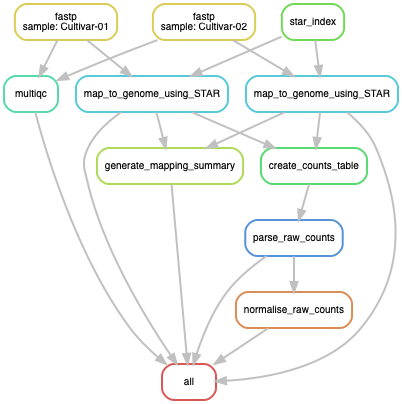

# RNA_seq_Snakemake
A snakemake pipeline for the analysis of RNA-seq data that makes use of [hisat2](https://ccb.jhu.edu/software/hisat2/index.shtml) and [DESeq2](https://bioconductor.org/packages/release/bioc/html/DESeq2.html).

# Aim
To align, count, normalize counts and compute gene differential expressions between conditions using paired-end Illumina RNA-seq data.

# Description
This pipeline analyses the raw RNA-seq data and produces a file containing normalized counts, differential expression, numbers of the clusters the genes have been assigned to and functions of transcripts.
The raw fastq files will be trimmed for adaptors and quality checked with `fastp`. Next, the necessary genome sequence FASTA file will be downloaded and used for the mapping step of the trimmed reads using `hisat2`. A combined GTF annotation will be created by merging the mapping-related `stringtie` annotation with the downloaded reference annotation. This new annotation will then be used to obtain the raw counts using `subread featureCounts`. A local blast to a reference transcriptome fasta file will be performed to transfer gene predicted functions. The counts are subsequently normalized and differential expressions are computed using `DESeq2`. Significantly differentially expressed genes are used to create heatmaps and various plots. Finally the DESeq2, blast and clustering results are combined to get the final results table called `results.tsv`.

# Prerequisites: what you should be able to do before using this Snakemake pipeline
- Some command of the Unix Shell to connect to a remote server where you will execute the pipeline (e.g. SURF Lisa Cluster). You can find a good tutorial from the Software Carpentry Foundation [here](https://swcarpentry.github.io/shell-novice/) and another one from Berlin Bioinformatics [here](http://bioinformatics.mdc-berlin.de/intro2UnixandSGE/unix_for_beginners/README.html).
- Some command of the Unix Shell to transfer datasets to and from a remote server (to transfer sequencing files and retrieve the results/). The Berlin Bioinformatics Unix begginer guide available [here] should be sufficient for that (check the `wget` and `scp` commands).
- An understanding of the steps of a canonical RNA-Seq analysis (trimming, alignment, etc.). You can find some info [here](https://bitesizebio.com/13542/what-everyone-should-know-about-rna-seq/).

# Content of the github repository
- `Snakefile`: a master file that contains the desired outputs and the rules to generate them from the input files.
- `config.yaml`: the configuration files making the Snakefile adaptable to any input files, genome and parameter for the rules.
- `data/`: a folder containing samples.txt (sample descriptions) and subsetted paired-end fastq files used to test locally the pipeline. Generated using [Seqtk](https://github.com/lh3/seqtk):
`seqtk sample -s100 {inputfile(can be gzipped)} 250000 > {output(always gunzipped)}`
This folder should contain the `fastq` of the paired-end RNA-seq data, you want to run.
- `envs/`: a folder containing the environments needed for the conda package manager. If run with the `--use-conda` command, Snakemake will install the necessary softwares and packages using the conda environment files.
- `samples.tsv`:  a file containing information about the names, the paths and the conditions of the samples used as input for the pipeline. **This file has to be adapted to your sample names before running the pipeline**.
- `Dockerfile`: a Docker file used to build the docker image that, once run using `docker run rnaseq:dockerfile Snakemake --cores N --use-conda` will trigger installation of the necessary softwares and run the Snakemake pipeline.

# Usage (local machine)

## Download or clone the Github repository
You will need a local copy of the `Snakemake_hisat-DESeq` on your machine. You can either:
- use git in the shell: `git clone git@github.com:KoesGroup/Snakemake_hisat-DESeq.git`
- click on "Clone or download" and select `download`

## Installing the required software and packages (option 1: conda)
:round_pushpin: Option 1: using the conda package manager :one:  
First, you need to create an environment where core softwares such as `Snakemake` will be installed. Second, Snakemake itself will use conda to install the required softwares in each rule.
1. Install the Miniconda3 distribution (Python 3.7 version) for your system (Windows, Linux or Mac OS X).  
2. Inside a Shell window (command line interface), create a virtual environment named `rnaseq` using the `global_env.yaml` file with the following command: `conda env create --name rnaseq --file envs/global_env.yaml`
3. Then, before you run the Snakemake pipeline, activate this virtual environment with `source activate rnaseq`.

The Snakefile will then take care of installing and loading the packages and softwares required by each step of the pipeline.

## Installing the required software and packages (option 2: Docker & Singularity)
:round_pushpin: Option 2: using a Docker container :two:  
1. Install Docker desktop for your operating system.
2. Open a Shell window and type: `docker pull mgalland/rnaseq` to retrieve a Docker container that includes the pipeline required softwares (Snakemake and conda and many others).
3. Run the pipeline on your system with:
` docker run --mount source=<data folder on host machine>,target=<folder inside container that will corresponds to data folder> mgalland/rnaseq Snakemake --use-conda --cores N`.

For instance, in a Shell window, go inside the `Snakemake_hisat-DESeq` directory and type: `docker run -it -v $PWD:/rnaseq mgalland/snakemake /bin/bash`.  
This will link your working directory (`Snakemake_hisat-DESeq`) to a directory called `/rnaseq` inside the container. Then, the ` -it` option will have you to enter the container where you can run Snakemake commands and retrieve your data folder.    
Finally, to export your results outside of the container, you can use the Docker `cp` command. See it there: https://docs.docker.com/engine/reference/commandline/cp/.

# Usage (HPC cluster)
singularity + docker image

## Configuration file
Make sure you have changed the parameters in the `config.yaml` file that specifies where to find the sample data file, the genomic and transcriptomic reference fasta files to use and the parameters for certains rules etc.  
This file is used so the `Snakefile` does not need to be changed when locations or parameters need to be changed.

## Snakemake execution
The Snakemake pipeline/workflow management system reads a master file (often called `Snakefile`) to list the steps to be executed and defining their order. It has many rich features. Read more [here](https://snakemake.readthedocs.io/en/stable/).

## Dry run
From the folder containing the `Snakefile`, use the command `snakemake --use-conda -np` to perform a dry run that prints out the rules and commands.

## Real run
Simply type `Snakemake --use-conda` and provide the number of cores with `--cores 10` for ten cores for instance.  
For cluster execution, please refer to the [Snakemake reference](https://snakemake.readthedocs.io/en/stable/executable.html#cluster-execution).

# Main outputs
- the RNA-Seq read alignment files __*.bam__
- the fastqc report files __\*.html__
- the unscaled RNA-Seq read counts: __counts.txt__
- the differential expression file __results.tsv__

- the combined results file __final.txt__

# Directed Acyclic Graph of jobs

